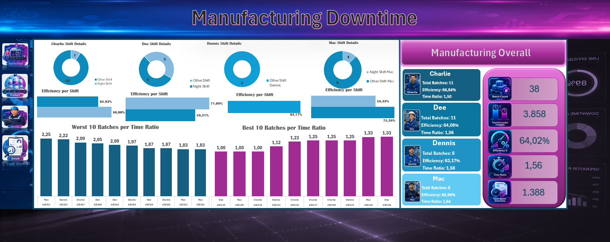
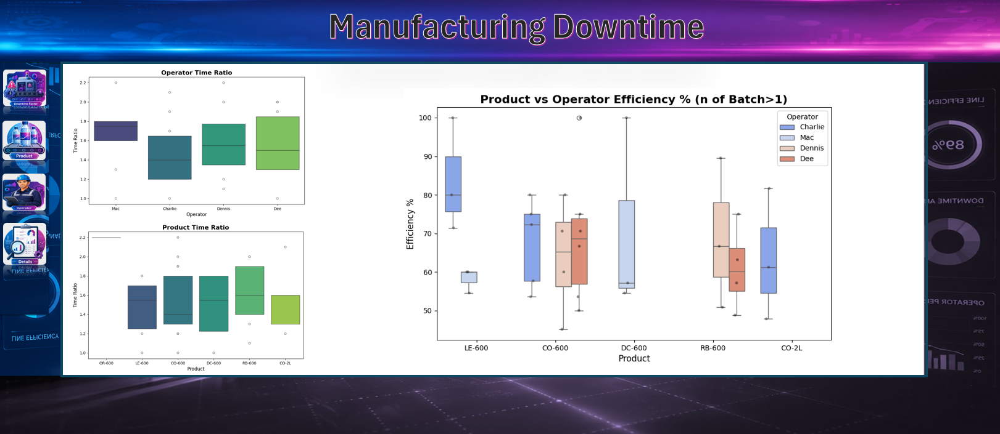

# Manufacturing Downtime Analysis

## Project Overview

This project is a manufacturing downtime and productivity analysis built mainly in Microsoft Excel, with additional support from Power Query, Power Pivot, and Python.

The main goal was to understand how efficiently the production line was running, which downtime factors caused the biggest losses, and how operator and product performance compared across different batches.

A key part of the analysis was to avoid comparing operators only by total production time, because each operator worked on a different product mix. For that reason, I used Time Ratio to compare the actual production time against the minimum expected batch time for each product.

---

## Business Questions

The project focuses on the following questions:

1. What is the overall production line efficiency?
2. Which products and operators show lower efficiency?
3. What are the main downtime factors?
4. Which operator/factor combinations contribute most to downtime?
5. How does production time ratio vary by operator and product?

---

## Tools Used

- Microsoft Excel
- Power Query
- Power Pivot
- Pivot Tables
- Excel Data Model / Star Schema
- DAX measures
- Python
- pandas
- matplotlib
- seaborn

---

## Dashboard Pages

The Excel workbook contains three main dashboard pages:

1. **Operator Dashboard**  
   This page focuses on operator performance, batch count, efficiency, time ratio, shift details, and best/worst batches.

2. **Products & Downtimes Dashboard**  
   This page shows product efficiency, production counts, main downtime factors, Pareto downtime analysis, and downtime by operator and factor.

3. **Details Dashboard**  
   This page includes extra analysis using time ratio and product/operator efficiency comparisons.

Supporting sheets with cleaned data, pivot tables, and helper calculations are hidden in the workbook so that the final file stays clean and easy to use.

The dashboard also includes a navigation sidebar with clickable icons. Each icon links to a specific dashboard page, so that the user can navigate through the Operator Dashboard, Products & Downtimes Dashboard, and Details Dashboard directly from workbook interface.

---

## Key Metrics

- Total Batches: 38
- Total Production Time: 3.858 minutes
- Overall Efficiency: 64,02%
- Overall Time Ratio: 1,56
- Total Batch Overtime: 1.388 minutes

---

## Key Findings

- Machine adjustment was the largest downtime factor.
- Machine failure and inventory shortage were also major contributors.
- Operator comparison needed careful interpretation because not all operators worked on the same product mix.
- Time Ratio was selected in order to have fairer results among operators by comparing actual production time with the minimum expected batch time.
- Product/operator combinations with only one batch were excluded from the boxplot comparison, because boxplots are more meaningful when there are repeated observations.

---

## Methodology

The project included the following steps:

1. Cleaning and transforming the manufacturing data in Power Query.
2. Creating calculated fields for production time, batch overtime, efficiency, and time ratio.
3. Building pivot tables and helper sheets to support the dashboards.
4. Designing the Excel dashboards and adding navigation between pages.
5. Using Python to create boxplots for additional exploratory analysis.
6. Interpreting the results while considering product mix, downtime factors, and small sample sizes in some product/operator combinations.

---

## Credits

Dataset source: Maven Analytics guided project dataset.

Some dashboard visual assets, such as icons and background images, were AI-generated and used only for presentation purposes.

---

## Python Analysis

Python was used to generate the boxplot analysis included in the Details Dashboard:

- Time Ratio by Operator
- Time Ratio by Product
- Product vs Operator Efficiency, filtered to groups with more than one batch

The Python script can be found in:

```text
Python_files/manufacturing_boxplots.py
```

---

## Screenshots

### Operator Dashboard



### Products & Downtimes Dashboard


### Details Dashboard



---

## Project Focus

This project was built to demonstrate:

- Excel dashboard design
- Power Query data preparation
- Data modeling logic
- Pivot based analysis
- DAX measures for KPI calculations, ratios, and downtime ranking
- Manufacturing performance analysis
- Downtime factor analysis
- Exploratory visualization using Python
- Statistical thinking for production and quality improvement
- Interactive Excel navigation using linked dashboard icons
